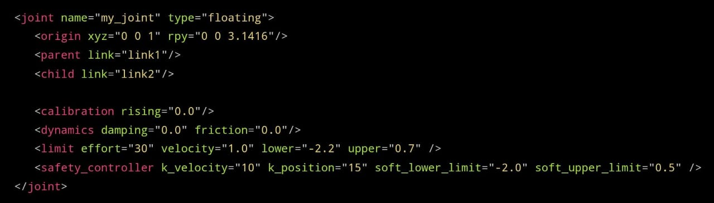
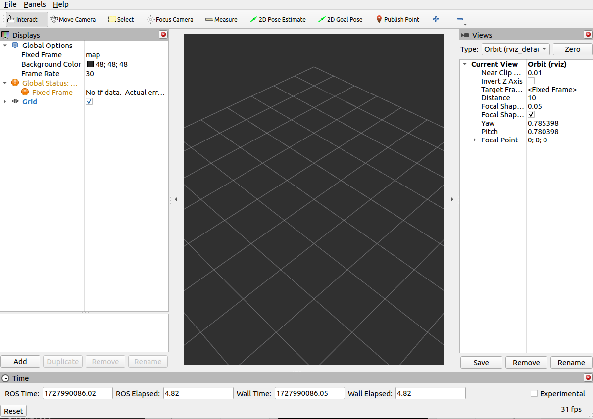

# Práctica 1 URDF

## Objetivo

El objetivo de esta practica es que el alumno comprenda, interprete y modifique la unformación básica de los formatos de Universal Robot Description FIle (URDF)

## Metas
- Que el alumno comprenda el orden de los archivos que comprenden los espacios de trabajo (WS) y los paquetes que los integran en ROS 2
- Que el alumno comprenda la estructura básica de un archivo URDF.
- Que el alumno sea capaz de modificar la información básica de los archivos URDF para modificar la descripción de un robot serial.
- Que el alumno conozca los elementos de los archivos launch en ROS 2.
- Que el alumno sea capaz de vizualizar un robot descrito en un archivo URDF mediante la aplicación de RVIZ

### Contribución al perfil del egresado

La siguiente práctica contribuye en los siguientes puntos al perfil del egresado:

#### Aptitudes y habilidades

- Para modelar, simular e interpretar el comportamiento de los sistemas mecatrónicos.
- Para desarrollar, operar y mantener procesos productivos que impliquen la transformación de materia, energía e información.
- Para diseñar, construir, operar y mantener los sistemas mecatrónicos y sus componentes.

#### Actitudes

- Ser creativo e innovador.
- Tener confianza en su preparación académica.
- Comprometido con su actualización, superación y competencia profesional.

#### De tipo social

- Promover el cambio en la mentalidad frente a la competitividad internacional.

## Rúbrica de evaluación

La evaluación de la práctica contará de los siguientes puntos:

| Elemento | Porcentaje |
| ------:| ----------- |
| ***Previo*** | 25% | 
| **Desarrollo** | 25% |
| **Resultado**  | 25% |
| **Conclusiones** | 25% |

Los siguientes elementos se evaluaran con base en los siguientes criterios:

| Elemento | Malo | Regular | Bueno | Muy bueno| 
| ------:| ------ | --------| ------| --------  |
| ***Previo*** | El previo no contiene los elemtos solocitados (0%)| El previo contiene parcialmente la infomración solocitada (10%) |  El previo contiene la infomración solocitada sin referencias (20%) | El previo contiene la información solicitada con referencias (25%) |
| **Desarrollo** | El desarrollo de la práctica no fue realizada (0%) | El desarrollo de la práctica fue pacialmente realizado (10%) | La práctica fue realizada pero no fue realizada correctamente (20%) | La práctica fue realizada en su totalidad correctamente (25%) |
| **Resultado**  | No se entregarón los resultados de la práctica (0%)| Se entregaron pracialmente los resultados (10%) | Se entregaron los resultados sin descripción (20%) | Se entregaron los resultados de la práctica y son interpetrables(25%) |
| **Conclusiones** | No se entragaron conclusiones (0%) | Las conclusciones no están relacionadas con el objetivo de la práctica (5%) | Las conclusciones se relacionan con el objetivo de práctica (10%) | Las concluscions se relacionana con el objetivo de la práctica y se basan en los resultados obtenidos (25%) | 

# Previo

## Definición de URDF:

Por sus siglas en inglés, Unified Robot Description Format, es una especificación XML que permite describir cómo es un robot, de modo que mediante elementos XML se pueden definir las siguientes características del mismo:

- El aspecto visual

- Su cinemática y dinámica

- El modelo de colisión

## Tipos de juntas que estás definidas dentro del formato URDF

- Revolute: Permite el giro sobre un eje y tiene un rango limitado especificado por los límites superior e inferior.
  
- Continuos: Permite el deslizamiento a lo largo de un eje y no tiene límites superior e inferior.

- Prismatic: Permite el deslizamiento a lo largo de un eje y tiene rango limitado especificado por los límites superior e inferior.

- Fixed: No permite ningún tipo de movimiento por lo que realmente no es una articulación, pero es útil cuando interesa asociar al enlace un sistema de referencia en un punto concreto, por ejemplo para el caso de sensores o cámaras.

- FLoating: Permite el movimiento en 6 grados de libertad.

- Planar: Permite el movimiento en un pano perpendicular al eje.

## Definición de elementos "primitivos" que se pueden utilizar para definir un robot en ROS.

### *Estructura base:* 

Dado que un URDF contine código XML, lo primero que debe aparecer es el encabezado que define a  este tipo de archivos y a continuación el elemento "\<robot>, el cuál encapsulará los elementos del robot. Es fundamental que este elemento contenga el atributo "name", pues es el nombre que se le asignará al robot.

 

### *El elemento \<link>:*

Permite definir como es cada uno de los enlaces de nuestro robot, estableciendo tanto su apariencia visual como sus propiedades físicas. Para ello, admite los siguientes elementos (todos opcionales):
 
#### Elementos y atributos admitidos por \<link>: 

- Elemento \<inertial>:

Permite inidcar la masa del enlace y sus momentos de inercia, que se calculan en referencia a un sistema de referencia "C" ubicado en el centro de gravedad.

- Atributo \<origin>: 

Indica la posición y la orientación del sistema de referencia "C" ubicado en el centro de gravedad del enlace, en relación al sistema de referencia "L" ubicado en la articulación con el enlace padre.

- Atributo \<mass>:

Elemento requerido. Establece la masa del enlace.

- Atributo \<inertia>:

Establece los momentos de inercia del eslabón **ixx, iyy, izz** y los productos de inercia **ixy, ixz, iyz** sobre "Co" (el centro de masa del eslabon)  
 

- Elemento \<Visual>:

Proporciona la información relativa a la representación visual del enlace, es decir, su posicón, orientación, forma y aspecto.

Para establecer la posición y orientación es necesario indicar la pose del sistema de referencia "V", que para las figuras básicas (cilindros, cajas y esferas) que admite la especificación URDF, se encuentra en el centro geométrico de las mismas, y para formas más complejas (mallas) se establece durante su diseño cuando se emplea un software de modelado como Fusion3600 o Solidworks.

- El elemento \<collision>:

Define cómo es la forma que se tendrá en cuenta para calcular las posibles colisiones del enlace con otros objetos. 

No tiene por qué coincidir con la geometría que define el aspecto visual del enlace, ya que a menudo se utilizan modelos de colisión más simples para reducir el tiempo de cálculo.

- Atributo \<origin>:

Define el sistema de referencia "V" del elemento de colisión, relativo al sistema de referencia "L" del enlace. 

- Atributo \<geometry>:

Establece la forma del objeto empleado para la detección de colisines. Admite los mismos elementos que el elemento \<visual>.

### *El elemento \<joint>:*

Permite definir la cinemática y la dinámica de cada una de las articulaciones, así cómo sus límites de seguridad.

#### Elementos y atributos admitidos por \<joint>:

- Elemento \<origin>:

Indica la ubicación y orientación del sistema de referencia "L" del enlace hijo. Este sistema de referencia forma parte de la definición de la cadena cinemática y se ubica en la articulación con el enlace padre, de modo que uno de sus ejes conincide en función del tipo de articulación con el eje de giro o con el eje de desplazamiento. 

- Elementos \<parent>:

Link padre. Solo posee el atributo "LINK" es cuál es el nombre del link padre.

- Elemento \<child>:

Link hijo. Solo posee el atributo "LINK" es cuál es el nombre del link hijo.

- Elemento \<axis>:

Es un elemento para las articulaciones de tipo *revolute, continuous o prismatic*. Permite indicar cuál de los ejes del sistema de referencia "L" coincide con el eje de giro o de desplazamiento de la articulación. 

- Elemento \<dynamics>:

Permite indicar las popiedades dinámicas de la articulación. Estableciendo los coeficientes de rozamiento estático y amortiguamiento.

- Elemento \<limit>: 

Permite establecer el rango del movimiento de la articulación, así cómo la velocidad máxima que puede alcanzar o el esfuerzo máximo que es capaz de desarrollar. 

- Elemento \<safety_controller>:

Permite establecer las relaciones límite entre *posición/velocidad* y *velocidad/esfuerzo*. 

- Elemento \<calibration>:

Establece la posición de referencia de la articulación, la cual es empleada para calibrar su posición absoluta. Permite lanzar una señal de flanco de subida o de bajada cuando se alcanza la posición de referencia. 

- Elemento \<mimic>:

Permite que una articulación imite los movimientos de otra articulación. 

## Que es un nodo y que es un topico en ROS 2

### *Nodos:*

Son los bloques fundamentales de un sistema ROS2. Es, esencialmente, un proceso único y ejecutable que realiza cálculos o ejecuta comandos.

Cada nodo está diseñado para realizar una tarea específica dentro de un sistema robótico, cómo controlar un motor, procesar datos de sensores o comunicarse con otros nodos. 

Los nodos se comunican entre sí mediante la transmisión de topics, RPC services y el Parameter Server.  

Los nodos permiten tener un enfoque modular a la hora de desarrollar sistemas robóticos complejos mediante la combinacón de multiples nodos pequeños, reutilizables e independiente. 

Los nodos se escriben con el uso de una ROS client library, como roscpp o rospy.

#### Parametros de los nodos:

- _name:

Es una palabra clave reservada especial para "el nombre del nodo". Le permite reasignar el nombre del nodo sin tener que saber su nombre real. Solo se puede utilizar si el programa que se está iniciando contiene un nodo. 

- _log:

Es una palabra clave reservada que designa la ubicación en la que se debe escribir el archivo de registro del nodo. Por lo general, no se recomienda el uso de esta palabra clave; se proporciona principalmente para que la utilicen herramientas ROS como roslaunch.  

- _ip y _ hostname:

Son sustitutos de ROS_IP y ROS_HOSTNAME. Por lo general, no se recomienda el uso de esta palabra clave, ya que se proporciona para casos especiales en los que no se pueden establecer variables de entorno. 

- _master:

Es un sustituto de ROS_MASTER_URI. Por lo general, no se recomienda el uso de esta palabra clave, ya que se proporciona para casos especiales en los que no se pueden establecer variables de entorno. 

- _ns: 

Es un sustituto de ROS_NAMESPACE. Por lo general, no se recomienda el uso de esta palabra clave, ya que se proporciona para casos especiales en los que no se pueden establecer variables de entorno. 

### *Tópicos:*

Es un nombre para un flujo de mensajes con un tipo de datos determinado. Un nodo puede suscribirse o publicar.

La comunicación sobre los tópicos ocurre enviando mensajes ROS entre nodos. Para que el editor y el suscriptor se comuniquen, el editor y el suscriptor deben enviar y recibir el mismo tipo de mensaje.

La herramienta mśs utilizada es *rostopic*, la cual le permite obtener información sobre los tópicos 'ROS'.

#### Comandos:

- rostopic type:

Determina el tipo de mensaje.

- rostopic pub:

Publica datos en un tópico que ya está siendo emitido.

- rostopic echo:

Muestra la información publicada por un tópico.
  
- rostopic hz:

Informa la velocidad a la que se publican los datos.

- rqt_plot:

Muestra un gráfico de desplazamiento de tiempo de los datos publicados en los tópicos. 

- rostopic list:

Devuelve una lista de todos los tópicos actualmente suscritos y publicados.

## Que es RVIZ    

Es un entorno de visualización 3D que permite combinar en una misma pantalla modelos de robots, datos de sensores y otros datos en 3D. 

Para poder obtener una visualización del modelo tridimensional de un robot, Rviz requiere una descripción de este en formato URDF, que es un archivo en XML en donde se especifican, el tamaño del robot, el número de joints y links y la posición de estos, los ejes de rotación, los tipos de joints, entre otros datos que servirán para una representación fiel del modelo del robot dentro de Rviz.

# Referencias:

- J. E. Cabrera Muñoz. “Todo lo que necesitas saber de los archivos URDF -”. - Todo lo que necesitas saber de los archivos URDF. Accedido el 3 de octubre de 2024. [En línea]. Disponible: https://robotica-facil-con-ros2.es/?p=1439

- J. I. Labrador Aya y D. F. Romero Ibañez. “1trabajo fin de grado en ingeniería en automatización facultad de ciencias e ingenierías simulación de un robot hexapodo con ros y gazebo”. Repositorio Institucional - Universidad Jorge Tadeo Lozano. Accedido el 3 de octubre de 2024. [En línea]. Disponible: https://expeditiorepositorio.utadeo.edu.co/bitstream/handle/20.500.12010/16932/Simulacion%20de%20un%20robot%20hexapodo%20con%20ROS%20y%20Gazebo%20Labrador%20Aya.pdf?sequence=1&amp;isAllowed=y

- Página Principal | FING. Accedido el 3 de octubre de 2024. [En línea]. Disponible: https://eva.fing.edu.uy/pluginfile.php/481276/mod_resource/content/2/16%20-%20ROS%201.pdf

- I. P. Hurtado de Mendoza. “Introducción a ROS”. Inicio | Departamento de CCIA de la Universidad de Sevilla. Accedido el 3 de octubre de 2024. [En línea]. Disponible: https://www.cs.us.es/~fsancho/Cursos/MCVA2122/slides/introduccion_ros_1.pdf

- J. T. Quesada. “Guía de manejo de sistemas - ROS, pepper y deep learning”. Escuela politécnica superior. Accedido el 3 de octubre de 2024. [En línea]. Disponible: https://rua.ua.es/dspace/bitstream/10045/69390/1/Captura_visualizacion_y_seguimiento_de_Objetos_TONDA_QUESADA_JORGE.pdf

- J. E. RIva. “Es/ROS/Tutoriales/ComprendiendoTopicosROS - ROS wiki”. Documentation - ROS Wiki. Accedido el 3 de octubre de 2024. [En línea]. Disponible: http://wiki.ros.org/es/ROS/Tutoriales/ComprendiendoTopicosROS

- S. Kumar. “Getting started with ROS2: Understanding nodes”. Medium. Accedido el 3 de octubre de 2024. [En línea]. Disponible: https://medium.com/spinor/getting-started-with-ros2-understanding-nodes-075e9cde2863

- “Es/Nodes - ROS wiki”. Documentation - ROS Wiki. Accedido el 3 de octubre de 2024. [En línea]. Disponible: http://wiki.ros.org/es/Nodes

- “Es/ROS/Tutoriales/ComprendiendoTopicosROS - ROS wiki”. Documentation - ROS Wiki. Accedido el 3 de octubre de 2024. [En línea]. Disponible: http://wiki.ros.org/es/ROS/Tutoriales/ComprendiendoTopicosROS

# Desarrollo:

